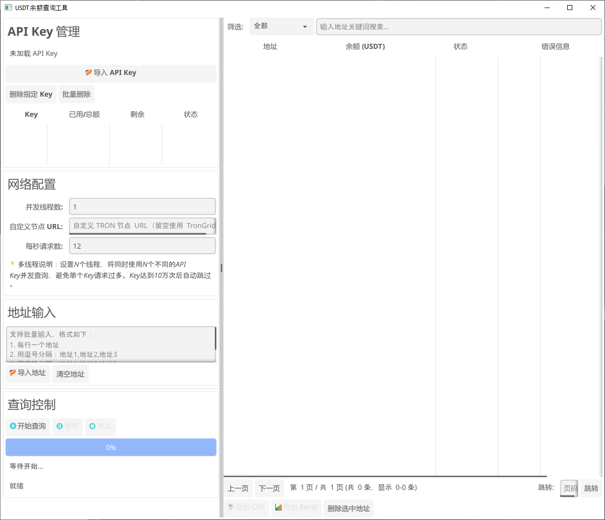

# 💰 USDT 余额查询工具
[🌍 English Version](README_en.md)

一个用于 **批量查询 TRON 网络上 USDT (TRC-20)** 余额的桌面工具，支持 **GUI** 和 **CLI** 两种模式。

---

## ✨ 功能特性

- ✅ **批量查询**：支持批量查询多个 TRON 地址的 USDT 余额  
- ✅ **多线程并发**：使用 Go 协程实现高效并发查询  
- ✅ **智能限流**：自动限流控制（10–15次/秒），避免 API 封禁  
- ✅ **自动重试**：遇到 429 错误时自动延迟重试  
- ✅ **文件导入**：支持导入 TXT / CSV 格式的地址文件  
- ✅ **结果导出**：支持导出为 CSV 或 Excel 格式  
- ✅ **进度显示**：实时显示查询进度和统计信息  
- ✅ **错误处理**：详细的错误提示和处理机制  
- ✅ **API Key 支持**：支持配置 TronGrid API Key  
- ✅ **自定义节点**：可切换自建 TRON 节点  

---

### 🖥️ 主界面


---

## ⚙️ 配置文件
如果自行编译，请确保项目中包含 `apikey_stats.json` 文件。

---

## 📦 安装

### 1. 下载二进制文件
[usdt_balance_checker_1.0](https://github.com/usdtcheck/usdt_balance_checker/releases/tag/usdt_balance_checker_1.0)

### 2. 从源码编译

1. 确保已安装 **Go 1.21 或更高版本**  
2. 克隆仓库或下载源码  
3. 安装依赖并编译：

````bash
git clone https://github.com/usdtcheck/usdt_balance_checker.git
go mod tidy
go build
````

---

## 🚀 使用方法

### GUI 模式（默认）

命令行运行程序，或双击可执行文件：

````bash
./usdt-balance-checker.exe
````

**操作步骤：**
1. **配置 API Key（可选）**：在“API 配置”区域输入 TronGrid API Key  
2. **输入地址**：  
   - 方式 1：在文本框中粘贴地址（每行一个，或以逗号/空格分隔）  
   - 方式 2：点击“导入文件”按钮，选择 TXT 或 CSV 文件  
3. **设置限流**：推荐 10–15 次/秒  
4. **开始查询**：点击“开始查询”按钮  
5. **查看结果**：查询结果会实时显示在表格中  
6. **导出结果**：点击“导出 CSV”或“导出 Excel”按钮  

---

### CLI 模式

使用命令行参数运行：

````bash
./usdt-balance-checker -cli -input addresses.txt -output results.csv
````

**参数说明：**
- `-cli`：启用 CLI 模式  
- `-input`：输入文件路径（TXT / CSV 格式）  
- `-output`：输出文件路径（默认 `results.csv`，支持 `.csv` 或 `.xlsx`）  
- `-api-key`：TronGrid API Key（可选）  
- `-node-url`：自定义 TRON 节点 URL（可选）  
- `-rate`：每秒请求数（默认 12）  

**示例：**
````bash
# 基本用法
./usdt-balance-checker -cli -input addresses.txt

# 指定 API Key 和输出格式
./usdt-balance-checker -cli -input addresses.txt -output results.xlsx -api-key YOUR_API_KEY

# 使用自定义节点
./usdt-balance-checker -cli -input addresses.txt -node-url https://your-node.com/wallet/triggerconstantcontract
````

---

## 🔑 导入 API Key 格式

每行一个 Key：
````
your key1
your key2
````

---

## 📄 导入 USDT 地址格式

### TXT 格式
````
TR7NHqjeKaxGTCi8q8Za4pL8otSzgjLj6t
TXYZabc123...
TXYZdef456...
````

### CSV 格式
地址可以放在任意列中，程序会自动识别：
````csv
地址,备注
TR7NHqjeKaxGTCi8q8Za4pL8otSzgjLj6t,钱包1
TXYZabc123...,钱包2
````

---

## 📤 输出文件格式

### CSV 格式
包含以下列：
- 地址  
- 余额（USDT，保留 6 位小数）  
- 状态（成功 / 失败 / 已取消）  
- 错误信息  

### Excel 格式
与 CSV 相同，但以 Excel 格式保存，带有表头样式和列宽优化。

---

## 🧩 API Key 申请

1. 访问 [TronGrid](https://www.trongrid.io)  
2. 注册并登录账户  
3. 创建 API Key  
4. 在程序中配置 API Key（可选，但推荐配置以获得更高限额）

---

## ⚙️ 技术细节

### 合约信息
- **USDT 合约地址**：`TR7NHqjeKaxGTCi8q8Za4pL8otSzgjLj6t`  
- **函数**：`balanceOf(address)`  
- **小数位数**：6 位  

### API 接口
使用 TronGrid 的 `triggerconstantcontract` 接口：  
- 接口地址：`https://api.trongrid.io/wallet/triggerconstantcontract`  
- 请求方法：POST  
- 请求格式：JSON  

### 地址转换
程序会自动将 TRON Base58 地址转换为 ABI 编码格式（32 字节 HEX）用于合约调用。

---

## ⚠️ 注意事项

1. **限流控制**：默认每秒 12 次请求，可根据需要调整（10–15 之间）  
2. **网络要求**：需要稳定的网络连接  
3. **地址格式**：仅支持标准的 TRON Base58 地址格式  
4. **错误处理**：失败时会显示详细错误信息  
5. **API Key**：建议配置，以获得更高的请求频率上限  

---

## 🧑‍💻 开发要求

- Go 1.21+  
- Fyne v2（用于 GUI）  
- 网络连接（访问 TronGrid API）

---

## 🤝 贡献

欢迎提交 Issue 或 Pull Request，一起改进项目！

---

## 🕓 更新日志

### v1.0.0
- 初始版本  
- 支持 GUI 与 CLI 模式  
- 支持批量查询与文件导入导出  
- 实现限流与重试机制  
