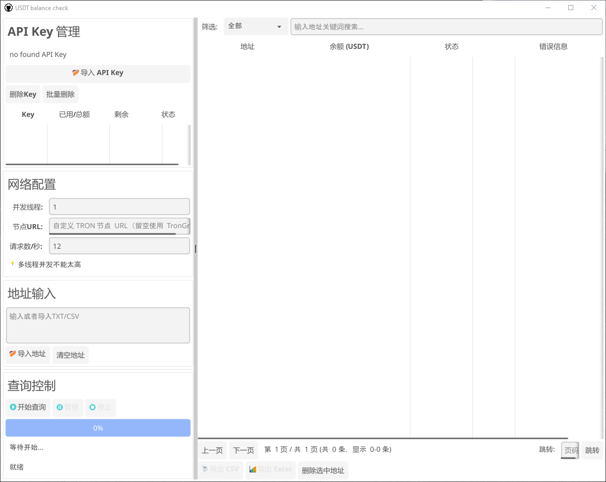

# 💰 USDT Balance Checker
[🇨🇳 中文版](README.md)

A desktop tool for **batch checking USDT (TRC-20)** balances on the **TRON network**, supporting both **GUI** and **CLI** modes.

---

## ✨ Features

- ✅ **Batch Query:** Query multiple TRON addresses’ USDT balances at once  
- ✅ **Multithreading:** Built with Go routines for high-performance concurrency  
- ✅ **Rate Limiting:** Automatically limits requests (10–15 per second) to avoid API blocking  
- ✅ **Auto Retry:** Automatically retries when encountering 429 errors  
- ✅ **File Import:** Supports importing addresses from TXT or CSV files  
- ✅ **Export Results:** Export data to CSV or Excel formats  
- ✅ **Progress Display:** Real-time progress and statistics  
- ✅ **Error Handling:** Detailed error messages and robust handling  
- ✅ **API Key Support:** Configure and use your own TronGrid API Key  
- ✅ **Custom Node:** Support for self-hosted TRON nodes  

---

### 🖥️ Main Interface


---

## ⚙️ Configuration File
If building from source, ensure the `apikey_stats.json` file is included in the project directory.

---

## 📦 Installation

### 1. Download Binary
[usdt_balance_checker_1.0](https://github.com/usdtcheck/usdt_balance_checker/releases/tag/usdt_balance_checker_1.0)

### 2. Build from Source

1. Make sure **Go 1.21+** is installed  
2. Clone the repository or download the source code  
3. Install dependencies and build:

````bash
git clone https://github.com/usdtcheck/usdt_balance_checker.git
go mod tidy
go build
````

---

## 🚀 Usage

### GUI Mode (default)

Run the program via command line or double-click the executable:

````bash
./usdt-balance-checker.exe
````

**Steps:**
1. **Configure API Key** (optional): Enter your TronGrid API Key  
2. **Input Addresses:**  
   - Option 1: Paste addresses directly (one per line, or separated by commas/spaces)  
   - Option 2: Import a TXT/CSV file  
3. **Set Rate Limit:** Recommended 10–15 requests/second  
4. **Start Query:** Click “Start Query”  
5. **View Results:** Results appear in real time  
6. **Export Results:** Export as CSV or Excel  

---

### CLI Mode

````bash
./usdt-balance-checker -cli -input addresses.txt -output results.csv
````

**Parameters:**
- `-cli`: Enable CLI mode  
- `-input`: Input file path (TXT or CSV)  
- `-output`: Output file path (default: `results.csv`, supports `.csv` and `.xlsx`)  
- `-api-key`: TronGrid API Key (optional)  
- `-node-url`: Custom TRON node URL (optional)  
- `-rate`: Requests per second (default: 12)

**Examples:**
````bash
# Basic usage
./usdt-balance-checker -cli -input addresses.txt

# Specify API key and output format
./usdt-balance-checker -cli -input addresses.txt -output results.xlsx -api-key YOUR_API_KEY

# Use a custom node
./usdt-balance-checker -cli -input addresses.txt -node-url https://your-node.com/wallet/triggerconstantcontract
````

---

## 🔑 Importing API Keys
Each line represents one key:
````
your key1
your key2
````

---

## 📄 Importing USDT Addresses

### TXT Format
````
TR7NHqjeKaxGTCi8q8Za4pL8otSzgjLj6t
TXYZabc123...
TXYZdef456...
````

### CSV Format
The program automatically detects addresses in any column.
````csv
Address,Note
TR7NHqjeKaxGTCi8q8Za4pL8otSzgjLj6t,Wallet 1
TXYZabc123...,Wallet 2
````

---

## 📤 Output File Format

### CSV
Includes columns:
- Address  
- Balance (USDT, 6 decimal places)  
- Status (Success / Failed / Cancelled)  
- Error message  

### Excel
Same as CSV, but with styled headers and formatted column widths.

---

## 🧩 API Key Registration

1. Visit [TronGrid](https://www.trongrid.io)  
2. Register an account and log in  
3. Create an API Key  
4. Configure the API Key in the application  

---

## ⚙️ Technical Details

### Contract Information
- **USDT Contract Address:** `TR7NHqjeKaxGTCi8q8Za4pL8otSzgjLj6t`  
- **Function:** `balanceOf(address)`  
- **Decimals:** 6  

### API Endpoint
Using TronGrid’s `triggerconstantcontract` API:  
- URL: `https://api.trongrid.io/wallet/triggerconstantcontract`  
- Method: POST  
- Format: JSON  

### Address Encoding
The program automatically converts TRON Base58 addresses into 32-byte ABI-encoded HEX format for contract calls.

---

## ⚠️ Notes

1. Default rate limit: 12 requests/second (adjustable)  
2. Requires stable internet connection  
3. Only supports standard TRON Base58 addresses  
4. Detailed error handling for failed queries  
5. API Key recommended for higher request limits  

---

## Question 
1. How to handle pop-up windows in Go's GUI?

## 🧑‍💻 Development Requirements

- Go 1.21+  
- Fyne v2 (for GUI)  
- Network connectivity (access to TronGrid API)

---

## 🤝 Contributing
Contributions via Issues and Pull Requests are welcome!

---

## 🕓 Changelog

### v1.0.0
- Initial release  
- Added GUI and CLI modes  
- Supports batch querying and file import/export  
- Implemented rate limiting and auto-retry
